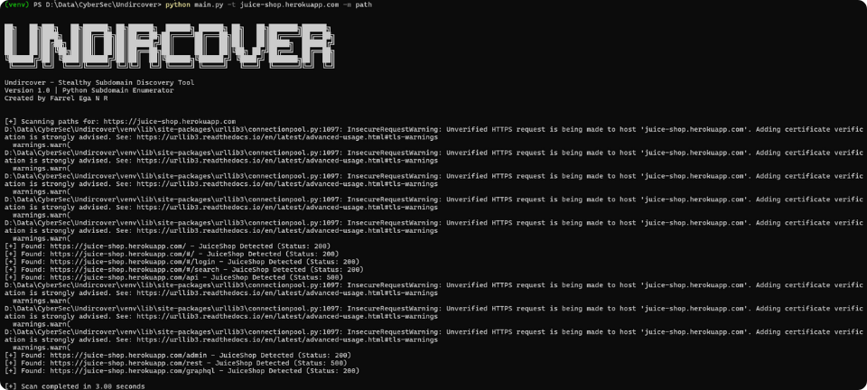

# 🔍Undircover

<div align=center>
  <br>
  <a href="https://github.com/farrelega/Undircover" target="_blank"></a>
  <br>

*Scan any domain and find hidden directories!*
  
  [](https://www.python.org/)
  [](LICENSE)

</div>

## ⚙️Installation
### Requirements
- Python 3.8+
- Pip (package manager)
### Steps
1. **Clone Repository**
```bash
https://github.com/farrelega/Undircover.git
```
2. **Setup Virtual Environment (Recommended)**
```bash
python -m venv venv
# Windows:
venv\Scripts\activate
# Mac/Linux:
source venv/bin/activate
```
3. **Install Dependencies**
```bash
pip install -r requirements.txt
```

## 🕹️Usage
### Parameter Options
| Parameters | Description | Default |
| - | - | - |
| `-t` | Target domain (required) | - |
| `-w` | Path to wordlist | - |
| `-p` | Protocol (http/https) | `https` |
| `-to` | Timeout (in sec) | `15` |
| `-m` | Scan mode (subdomain/path) | `subdomain` |

### Example Using
1. **Subdomain Scan**
```bash
python undircover.py -t example.com -w wordlists.txt -p https -to 10
```
2. **Path Scan**
```bash
python undircover.py -t example.com -m path
```
<div>
  <br>
    <a></a>
  <br>
</div>

## License

MIT © Undircover<br/>
Original Creator - [Farrel Ega](https://github.com/farrelega)
